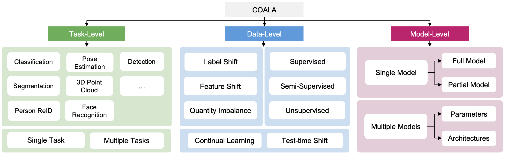

# Introduction

COALA is a practical and vision federated learning (FL) platform, and a suite of benchmarks for practical FL scenarios, which we categorize into three levels: task, data, and model.

At the task level, COALA extends support from simple classification to 15 computer vision tasks, including object detection, segmentation, pose estimation, and more. It also facilitates federated multiple-task learning, allowing clients to tackle multiple tasks simultaneously. 

At the data level, COALA goes beyond supervised FL to benchmark both semi-supervised FL and unsupervised FL. It also benchmarks feature distribution shifts other than commonly considered label distribution shifts. In addition to dealing with static data, it supports federated continual learning for continuously changing data in real-world scenarios. 

At the model level, COALA benchmarks FL with split models and different models in different clients. 

COALA platform offers three degrees of customization for practical FL scenarios, including configuration customization, components customization, and workflow customization.

It enables users with various levels of expertise to experiment and prototype FL applications with little/no coding. It aims to support production-level deployment of FL applications for a wide-range of business use cases, such as smart city, smart retail, and smart factory applications.

You can use it for:
* FL Research on algorithm and system
* Proof-of-concept (POC) of new FL applications
* Production-level FL applications

